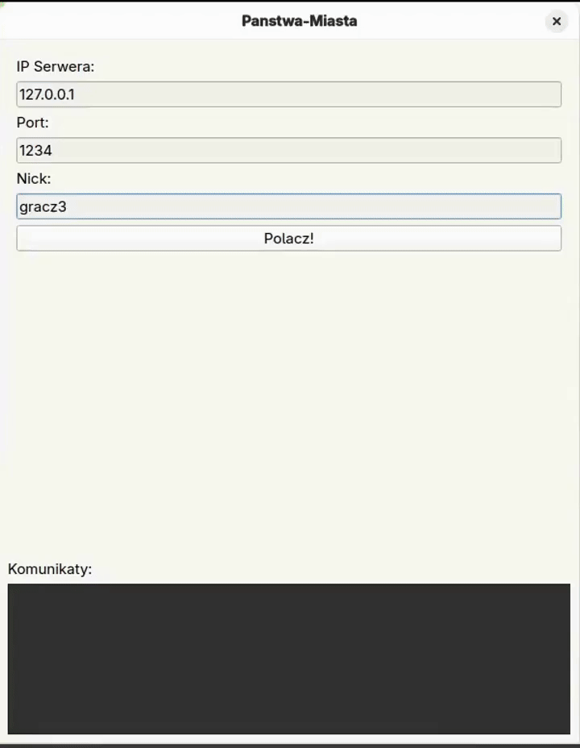

# Stop the Bus Network Game (Państwa-Miasta)


A multiplayer network game project implementing the classic "Stop the bus" pen-and-paper game  
created for the Networking course at PUT. Written in C++ using BSD Sockets for the server  
and Qt6 for the client interface.

---

### Demo


<p align="center">
  
</p>

---

## Features

* **Client-Server Architecture**: TCP connection handling multiple concurrent clients.
* **Lobby System**: Players can create custom rooms or join existing ones with live updates.
* **Admin Panel**: Special privileges for the admin, including:
  * Kicking players from rooms.
  * Deleting rooms.
  * Modifying game settings (round limits, player limits).


* **Gameplay Logic**:
  * Automatic random letter generation.
  * Categories: Country, City, River, Food, Name.
  * Real-time scoring system based on unique answers.
  * Timer-based rounds.

---

## Build

You need **CMake** and **Qt6** installed on your system.

```bash
mkdir build
cd build
cmake ..
make

```

### Usage

1. Start the Server:
```bash
./server <port>
```


2. Start the Client:
```bash
./client_gui
```


3. **Login:**
* Enter the Server IP and Port.
* Enter a Nickname.
* **Note:** Enter the nickname `admin` to access the Administrator Panel.
